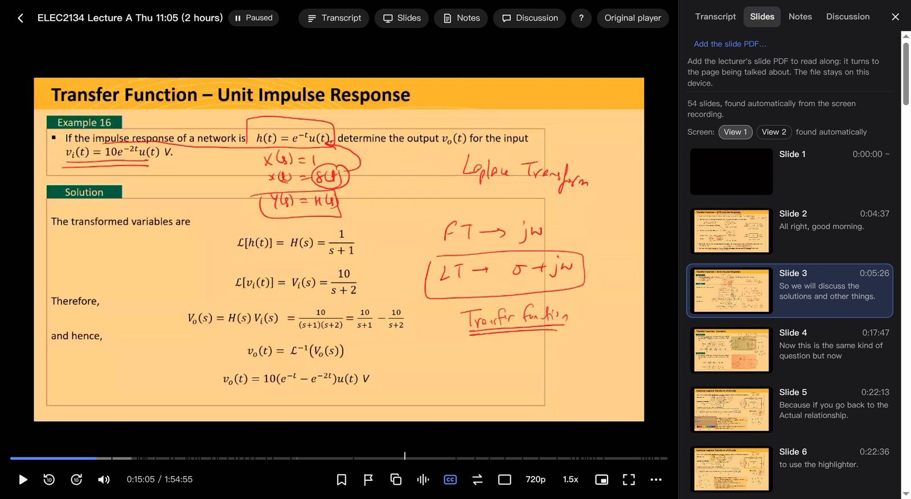

[English](README.md) | **简体中文**

# Echo360 Lite Player（Echo360 轻量播放器）

[](https://github.com/zhenban/echo360-lite/actions/workflows/ci.yml)
[](https://github.com/zhenban/echo360-lite/releases/latest)
[](LICENSE)

**一个用户脚本：用轻快的播放器看 Echo360 课程回放：CPU 占用低得多，两路画面并排，幻灯片章节，PDF 跟着讲课翻页，字幕、笔记等等。**



> **非官方项目。** 本项目与 Echo360、UNSW 没有任何关系，也未获其认可或支持。提到 “Echo360” 只是为了说明脚本适用于哪个网站。

原播放器播放时会让一个 CPU 核心一直满载，风扇响、耗电。Echo360 Lite 用浏览器自带的视频播放器播放同样的视频流，开销接近直接播放视频文件。在 `echo360.net.au`（澳大利亚）上测试过；认不出页面时会自动改用原播放器。

## 安装

1. 安装用户脚本管理器：[Tampermonkey](https://www.tampermonkey.net/) 或 [Violentmonkey](https://violentmonkey.github.io/)。
   Chrome / Edge：在 `chrome://extensions` 打开脚本管理器的“详细信息”，开启 **“允许用户脚本”**（旧版本是开启“开发者模式”）。
2. 安装脚本：从最新版本下载 **[echo360-lite.user.js](https://github.com/zhenban/echo360-lite/releases/latest/download/echo360-lite.user.js)**（脚本管理器会提示安装）。每个版本都附有更新说明。
3. 打开任意一节 Echo360 课程回放，浏览器控制台（F12）会显示 `[Echo360 Lite] v… active`。

## 功能

- **低 CPU 占用**：原生 `<video>` 配合 [hls.js](https://github.com/video-dev/hls.js)，使用硬件解码。
- **双路画面**：屏幕和摄像机可以并排（拖动分割线），也可以画中画（拖动、缩放、吸附四角），或者只显示一路。一键或按 `S` 交换主次，两路保持同步。
- **画面清晰**：始终使用网络允许的最高画质，屏幕和摄像机可分别设置。
- **字幕与转录**：字幕叠加，四档字号；转录面板跟随讲课进度，点击句子跳转，全文搜索并在进度条上标出结果。
- **笔记、书签、“没听懂”标记与讨论区**：和原播放器用同一份数据，与 Echo360 保持同步；带时间点的内容会标在进度条上。
- **音频处理**（默认关闭）：音量均衡（适合老师没戴麦克风的录像）、人声增强、单声道。
- **静音和空白画面检测**：在进度条上标出长时间静音（课间休息、小组讨论），以及画面全黑或空白且没人说话的时段；有“跳过”按钮，也可以开启自动跳过。录像结尾是长时间空白时，会提示课程内容已结束。
- **幻灯片章节**：自动找出屏幕画面里的每次换页。“幻灯片”标签页列出每一页的缩略图和老师讲的内容；进度条上标出章节分隔，悬停时显示预览。`Shift+←` / `Shift+→` 切到上一页 / 下一页。
- **跟着幻灯片读**：把老师的幻灯片 PDF 拖到播放器上，“幻灯片”标签页就变成一个 PDF 阅读器，随着讲课自动翻到正在讲的那页（识别屏幕上的文字，在 PDF 里找到对应的页）。你随时可以自己翻，点一下就能回到老师讲到的地方。PDF 只保存在你的设备上。
- **私人标签**：给笔记和书签加标签（“考试”“作业”或自己建的），按标签筛选，进度条上按颜色显示。标签只存在你的设备上。
- **放大和平移**：用滚轮或触控板放大屏幕画面、摄像机画面或幻灯片 PDF，拖动移动，双击复原。
- **A-B 循环**：反复播放一段（一个推导、一句话）。
- **观看进度**：进度条上显示看过的部分；课程页上每节课有一个小进度条，同时显示本设备看过的部分和 Echo360 记录的上次停下位置。
- **悬浮窗**：把整个播放器弹成一个置顶的小窗口，一边看一边写代码或做题。
- **导出和备份**：把笔记、书签和标签导出为 Markdown（带回到那一刻的链接；有幻灯片 PDF 时附带页面图片），可以导出一节课或整门课。只存在浏览器里的数据可以备份和恢复。
- **不被打断**：Echo360 的视频访问权限在后台自动续期，长时间观看不用刷新页面。
- **续播**：从上次停下的位置继续，换设备也有效（使用 Echo360 服务器记录的位置）。
- **如实上报观看记录**：和原播放器一样向 Echo360 报告观看进度，数据来自你实际播放的部分。
- **随时可以切回**：右上角“原播放器”按钮从当前位置切回 Echo360 播放器；出现任何问题时会自动退回原播放器，并为原播放器启用 CPU 补丁。

### 快捷键

| 按键 | 作用 |
|---|---|
| `空格` / `K` | 播放 / 暂停 |
| `←` / `→` | 后退 / 前进 5 秒 |
| `J` / `L` | 后退 / 前进 10 秒 |
| `↑` / `↓` | 音量 |
| `M` | 静音 |
| `F` | 全屏 |
| `S` | 交换画面 |
| `C` | 字幕 |
| `T` | 转录 |
| `B` | 书签 |
| `U` | “没听懂”标记 |
| `G` | 给当前位置的笔记或书签加标签 |
| `I` / `O` / `X` | 循环起点 / 循环终点 / 结束循环 |
| `+` / `-` / `0` | 放大 / 缩小 / 整幅画面 |
| `W` | 悬浮窗 |
| `E` | 导出和备份 |
| `?` | 全部快捷键 |
| `Shift+←` / `Shift+→` | 上一页 / 下一页幻灯片 |
| `P` | 复制当前画面 |
| `A` | 复制刚才讲的内容（转录，最近 60 秒） |
| `[` / `]` | 减速 / 加速 |
| `Esc` | 关闭菜单 |

## 隐私

- 脚本只在 Echo360 课程页面运行，除了 Echo360 本身，不向任何地方发送数据。
- 设置、续播位置和分析缓存只保存在你的浏览器里（localStorage 和 IndexedDB）。
- hls.js 从 jsDelivr 以固定版本加载，并附有 SHA-256 哈希（Tampermonkey 会拒绝不匹配的文件，此时脚本保留原播放器；Violentmonkey 目前不检查哈希）；pdf.js 和 Tesseract.js（文字识别）也以固定版本加载，只在录像添加了幻灯片 PDF 时加载。文字识别在你的浏览器里进行。
- 标签、观看进度、幻灯片文件和备份只存在你的设备上。导出和备份文件里从不包含视频本身或视频地址。
- 不会替你发布任何内容：对 Echo360 的写入（笔记、帖子、标记）只在你点击时发生；老师或同学能看到的内容，发送前会明确提示。
- 不提供下载功能。

## 已知限制

- 直播课程，以及需要先确认版权声明的录像，会使用原播放器。
- 投票、幻灯片、附件和口述影像只在原播放器里有（播放器里有按钮可以切过去）。
- 学校登录在播放中过期时会提示刷新，刷新后从当前位置继续（Echo360 的视频访问权限本身会在后台自动续期）。
- 没有 PDF 时的幻灯片章节：每段录像自己学习多大的画面变化算换页；屏幕很少整体变化的录像（摄像头拍白板）章节可能较少。如果在错误的画面里找幻灯片，可以在“幻灯片”标签页选择正确的画面。
- 跟读幻灯片 PDF 时按 PDF 的语言识别屏幕文字（英文、中文、日文、韩文、俄文、希腊文、阿拉伯文、希伯来文、泰文、印地文；其他按英文）。英文以外的语言首次需要下载文字识别数据（0.6–2.7 MB）。
- 没有转录的录像靠音频检测静音，离麦克风较远的小声说话可能会被当成静音。除非你开启自动跳过，是否跳过始终由你决定。

## 开发

```sh
npm install        # 开发工具（ESLint、用于检查的 TypeScript、happy-dom）
npm run build      # src/*.js -> dist/echo360-lite.user.js（可读，不压缩）
npm test           # 单元测试和整页测试
npm run ci         # 代码检查、类型检查、测试、dist/ 与源码一致（GitHub Actions 运行的就是这些）
```

只修改 `src/`（`dist/` 是生成的）。代码结构说明：[ARCHITECTURE.md](ARCHITECTURE.md)（英文）。

`src/` 下的源文件是普通脚本，按文件名顺序拼接。代码和注释用英文，界面文字集中在 `src/01-i18n.js`，所有调节参数（带单位和依据）集中在 `src/02-tuning.js`。

## 许可

Copyright (C) 2026 zhenban。Echo360 Lite 是自由软件：你可以按照自由软件基金会发布的 [GNU 通用公共许可证](LICENSE)第 3 版（或你选择的任何更高版本）的条款重新分发和修改它。发布它是希望它有用，但不提供任何担保。

**v0.14.0 及以前**的版本以 MIT 许可证发布，这些版本仍然适用 MIT；之后的版本使用 GPL。

运行时加载的第三方库（固定版本，从 jsDelivr 加载，不包含在本仓库中）：

| 库 | 用途 | 许可证 |
|---|---|---|
| [hls.js](https://github.com/video-dev/hls.js) 1.7.3 | 播放 HLS 视频流 | Apache-2.0 |
| [pdf.js](https://github.com/mozilla/pdf.js)（pdfjs-dist 6.4.299） | 读取幻灯片 PDF | Apache-2.0 |
| [Tesseract.js](https://github.com/naptha/tesseract.js) 7.0.0 和 tesseract.js-core 7.0.0 | 文字识别 | Apache-2.0 |
| [tesseract.js-data](https://github.com/naptha/tessdata) 1.0.0（语言数据） | 文字识别 | MIT |

Apache-2.0 和 MIT 的代码可以和 GPLv3 代码组合使用，所以这些库与本许可证兼容。

## 安全

如何私下报告安全问题，见 [SECURITY.md](SECURITY.md)。
